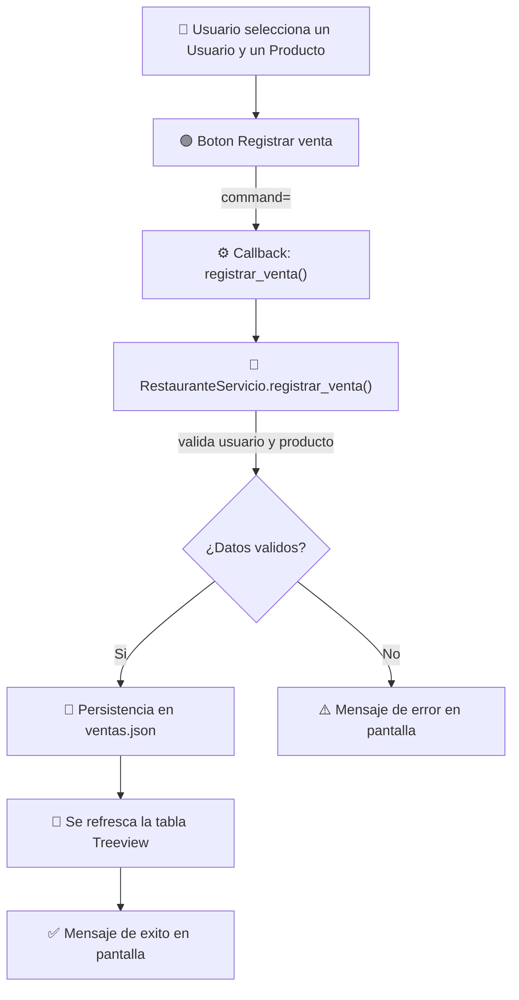

<div align="center">


# 🍔 Restaurante App

### Sistema de gestión para restaurante — Escritorio con Python & Tkinter

**Semana 15 · Programación Orientada a Objetos**
**Tema: Conceptos fundamentales de manejo de eventos**


</div>

---

## 📌 ¿Qué es este proyecto?

`restaurante_app` es una aplicación de escritorio construida en **Python + Tkinter/ttk** que gestiona el día a día de un restaurante: **usuarios**, **productos** y, desde esta semana, **ventas**. Cada semana del curso ha ido evolucionando el mismo proyecto sin reconstruirlo, y la Semana 15 se enfoca en un solo objetivo:

> Demostrar el fundamento básico del manejo de eventos: un **botón** → `command=` → un **callback** → un **servicio** → **persistencia** → **respuesta visual**.

La venta (relacionar un usuario con un producto) es simplemente el contexto práctico para evidenciarlo — no se implementó facturación, carrito ni inventario avanzado, porque eso no correspondía a esta semana.

---

## 🖼️ Vista previa

<div align="center">

| Inicio de sesión | Panel principal | Registro de ventas |
|:---:|:---:|:---:|
|  |  |  |

</div>

---

## 🧭 Flujo de eventos (lo central de esta semana)



La interfaz **nunca** toca `ventas.json` directamente: solo recolecta la selección del usuario y delega todo al servicio. Las validaciones, el cálculo del identificador (`V001`, `V002`, ...), la fecha y el guardado viven exclusivamente en `RestauranteServicio`.

---

## ✨ Funcionalidades

| Módulo | Estado | Descripción |
|---|:---:|---|
| 🔐 Inicio de sesión | ✅ | Autenticación contra `usuarios.json` vía `RestauranteServicio` |
| 🍕 Productos | ✅ | Registrar, consultar, actualizar y eliminar (heredado de semanas anteriores) |
| 👥 Usuarios | ✅ | Consulta de usuarios registrados |
| 💰 **Ventas** | ✅ **Nuevo — Semana 15** | Relacionar un usuario existente con un producto existente y registrar la operación |
| 🎨 Interfaz estilizada | ✅ | Iconos e identidad visual propios en `assets/` |

---

## 🗂️ Estructura del proyecto

```
restaurante_app/
├── datos/
│   ├── productos.json
│   ├── usuarios.json
│   └── ventas.json
├── modelos/
│   ├── producto.py
│   ├── usuario.py
│   └── venta.py
├── servicios/
│   ├── archivo_servicio.py
│   └── restaurante_servicio.py
├── ui/
│   ├── iconos.py
│   ├── login_view.py
│   └── main_view.py
├── assets/
│   ├── icons/
│   ├── logo/
│   └── capturas/
└── main.py
```

<details>
<summary>📎 Ver el detalle de la capa de Ventas</summary>

<br/>

- **`modelos/venta.py`** — representa una venta con `identificador`, `usuario_id`, `producto_codigo` y `fecha`, con validaciones básicas.
- **`servicios/restaurante_servicio.py`**
  - `registrar_venta(usuario_id, producto_codigo)` valida que ambos existan, genera el identificador secuencial, fecha la operación y guarda mediante `ArchivoServicio`.
  - `listar_ventas()` / `cantidad_ventas()` alimentan la interfaz.
- **`ui/main_view.py`**
  - El botón usa `command=self.registrar_venta` (la referencia al método, **no** `registrar_venta()`).
  - `registrar_venta()` es el callback: lee los combos, llama al servicio, refresca la tabla `Treeview` y muestra el resultado — sin lógica de negocio dentro de la interfaz.

</details>

---

## 🚀 Cómo ejecutarlo

```bash
# 1. Clonar el repositorio
git clone <url-de-este-repositorio>
cd restaurante_app

# 2. Ejecutar (Tkinter viene incluido con Python)
python main.py
```

**Credenciales de prueba** (definidas en `datos/usuarios.json`):

| Usuario | Contraseña |
|---|---|
| `Isabel` | `1234` |
| `Maria` | `frutas123` |

**Para probar el registro de una venta:**
1. Inicia sesión.
2. Ve a la sección **Ventas** en el menú superior.
3. Selecciona un usuario y un producto en los combos.
4. Presiona **Registrar venta**.
5. La venta aparece de inmediato en la tabla y queda guardada en `datos/ventas.json` (persiste al cerrar y reabrir la app).

---

## 🛠️ Tecnologías

<div align="center">


</div>

---

## 📚 Alcance de la Semana 15

Conforme a lo solicitado en la guía de esta semana, **no** se implementaron eventos avanzados como `bind()`, doble clic, `<<TreeviewSelect>>`, selección reactiva de filas, carrito de compras, facturación ni inventario avanzado. El propósito fue exclusivamente evidenciar el fundamento básico:

**botón → `command=` → callback → servicio → persistencia → respuesta visual.**

<div align="center">

---
Proyecto académico — Programación Orientada a Objetos · Semana 15

</div>
